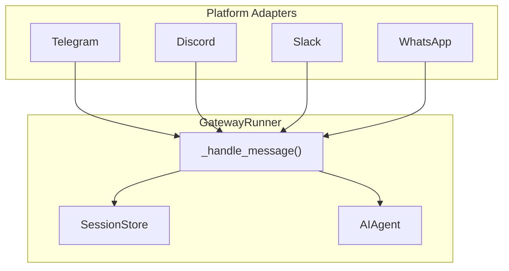

# DeepWiki Q&A with Code Context for Repository: NousResearch/hermes-agent
## Q1
How a gateway works? what do I need to create a new gateway?
### Answer
# How the Gateway Works

The Hermes messaging gateway is a long-running process that connects the agent to 20+ external messaging platforms through a unified architecture hermes-agent:9-10 .

## Architecture

The gateway centers around the `GatewayRunner` class in `gateway/run.py`, which manages the lifecycle of all platform adapters and routes messages to/from the agent hermes-agent:1977-1983 . Each messaging platform has its own adapter in `gateway/platforms/` that implements a shared interface hermes-agent:144-150 .



## Message Flow

When a message arrives from any platform:

1. **Platform adapter** receives the raw event and normalizes it into a `MessageEvent` hermes-agent:54-57
2. **Base adapter** checks if an agent is already running for this session - if so, it queues the message and sets an interrupt event hermes-agent:57-59
3. **GatewayRunner._handle_message()** receives the event, resolves the session key, checks authorization, and either dispatches slash commands or creates an `AIAgent` instance hermes-agent:60-66
4. **Response** is sent back through the platform adapter hermes-agent:66-67

## Configuration

The gateway reads configuration from multiple sources hermes-agent:132-142 :

- `~/.hermes/.env` - API keys, bot tokens, platform credentials
- `~/.hermes/config.yaml` - Model settings, tool configuration, display options
- Environment variables - Can override the above

The main configuration class is `GatewayConfig` in `gateway/config.py`, which manages platform connections, session policies, and delivery settings hermes-agent:498-504 .

---

# What You Need to Create a New Gateway

## 1. Platform Credentials

You need API keys or bot tokens for each messaging platform you want to connect. These are stored in `~/.hermes/.env` hermes-agent:132-142 .

## 2. Gateway Configuration

Run the interactive setup wizard:

```bash
hermes gateway setup
```

This walks you through configuring each platform with arrow-key selection, shows which platforms are already configured, and offers to start/restart the gateway when done hermes-agent:109-117 .

## 3. Start the Gateway

You can run the gateway in foreground mode:

```bash
hermes gateway run
```

Or install it as a service for automatic startup:

```bash
hermes gateway install              # Install as user service
sudo hermes gateway install --system  # Install as boot-time system service
```

The `run_gateway()` function in `hermes_cli/gateway.py` handles starting the gateway in foreground mode hermes-agent:3792-3801 .

## 4. Platform Adapter (For Custom Platforms)

If you want to add support for a new messaging platform not already supported, you would need to create a new adapter in `gateway/platforms/` that implements the `BaseAdapter` interface with methods like `connect()`, `disconnect()`, `send_message()`, and `on_message()` hermes-agent:174-178 .

## Notes

The gateway also includes a cron scheduler that ticks every 60 seconds to execute scheduled jobs hermes-agent:107-108 . Authorization is handled through a multi-layer check including platform allowlists, DM pairing, and global allow-all flags hermes-agent:90-99 .

Wiki pages you might want to explore:
- [Command Reference (NousResearch/hermes-agent)](/wiki/NousResearch/hermes-agent#3.2)
### Citations
**File:** website/docs/developer-guide/gateway-internals.md (L9-10)
```markdown
The messaging gateway is the long-running process that connects Hermes to 20+ external messaging platforms through a unified architecture.

```
**File:** website/docs/developer-guide/gateway-internals.md (L54-59)
```markdown
When a message arrives from any platform:

1. **Platform adapter** receives raw event, normalizes it into a `MessageEvent`
2. **Base adapter** checks active session guard:
   - If agent is running for this session → queue message, set interrupt event
   - If `/approve`, `/deny`, `/stop` → bypass guard (dispatched inline)
```
**File:** website/docs/developer-guide/gateway-internals.md (L60-67)
```markdown
3. **GatewayRunner._handle_message()** receives the event:
   - Resolve session key via `_session_key_for_source()` (format: `agent:main:{platform}:{chat_type}:{chat_id}`)
   - Check authorization (see Authorization below)
   - Check if it's a slash command → dispatch to command handler
   - Check if agent is already running → intercept commands like `/stop`, `/status`
   - Otherwise → create `AIAgent` instance and run conversation
4. **Response** is sent back through the platform adapter

```
**File:** website/docs/developer-guide/gateway-internals.md (L90-99)
```markdown
## Authorization

The gateway uses a multi-layer authorization check, evaluated in order:

1. **Per-platform allow-all flag** (e.g., `TELEGRAM_ALLOW_ALL_USERS`) — if set, all users on that platform are authorized
2. **Platform allowlist** (e.g., `TELEGRAM_ALLOWED_USERS`) — comma-separated user IDs
3. **DM pairing** — authenticated users can pair new users via a pairing code
4. **Global allow-all** (`GATEWAY_ALLOW_ALL_USERS`) — if set, all users across all platforms are authorized
5. **Default: deny** — unauthorized users are rejected

```
**File:** website/docs/developer-guide/gateway-internals.md (L132-142)
```markdown
## Config Sources

The gateway reads configuration from multiple sources:

| Source | What it provides |
|--------|-----------------|
| `~/.hermes/.env` | API keys, bot tokens, platform credentials |
| `~/.hermes/config.yaml` | Model settings, tool configuration, display options |
| Environment variables | Override any of the above |

Unlike the CLI (which uses `load_cli_config()` with hardcoded defaults), the gateway reads `config.yaml` directly via YAML loader. This means config keys that exist in the CLI's defaults dict but not in the user's config file may behave differently between CLI and gateway.
```
**File:** website/docs/developer-guide/gateway-internals.md (L144-150)
```markdown
## Platform Adapters

Each messaging platform has an adapter in `gateway/platforms/`:

```text
gateway/platforms/
├── base.py              # BaseAdapter — shared logic for all platforms
```
**File:** gateway/run.py (L1977-1983)
```python
class GatewayRunner(GatewayAuthorizationMixin, GatewayKanbanWatchersMixin, GatewaySlashCommandsMixin):
    """
    Main gateway controller.

    Manages the lifecycle of all platform adapters and routes
    messages to/from the agent.
    """
```
**File:** gateway/config.py (L498-504)
```python
@dataclass
class GatewayConfig:
    """
    Main gateway configuration.

    Manages all platform connections, session policies, and delivery settings.
    """
```
**File:** website/docs/user-guide/messaging/index.md (L107-108)
```markdown
Each platform adapter receives messages, routes them through a per-chat session store, and dispatches them to the AIAgent for processing. The gateway also runs the cron scheduler, ticking every 60 seconds to execute any due jobs.

```
**File:** website/docs/user-guide/messaging/index.md (L109-117)
```markdown
## Quick Setup

The easiest way to configure messaging platforms is the interactive wizard:

```bash
hermes gateway setup        # Interactive setup for all messaging platforms
```

This walks you through configuring each platform with arrow-key selection, shows which platforms are already configured, and offers to start/restart the gateway when done.
```
**File:** hermes_cli/gateway.py (L3792-3801)
```python
def run_gateway(verbose: int = 0, quiet: bool = False, replace: bool = False):
    """Run the gateway in foreground.

    Args:
        verbose: Stderr log verbosity count added on top of default WARNING (0=WARNING, 1=INFO, 2+=DEBUG).
        quiet: Suppress all stderr log output.
        replace: If True, kill any existing gateway instance before starting.
                 This prevents systemd restart loops when the old process
                 hasn't fully exited yet.
    """
```
**File:** website/i18n/zh-Hans/docusaurus-plugin-content-docs/current/developer-guide/gateway-internals.md (L174-178)
```markdown
适配器实现统一接口：
- `connect()` / `disconnect()` — 生命周期管理
- `send_message()` — 出站消息投递
- `on_message()` — 入站消息规范化 → `MessageEvent`

```
## Q2
What do you think is the more smart way to allow the agent output messages to a escpos printer connected via USB. And the user should interact with keyboard inputs for instance. Where to modify the hermes agents?
### Answer
The user wants to know the smartest way to add ESC/POS printer output (for agent responses) and keyboard input (for user interaction) to Hermes. This is essentially asking about creating a new platform adapter for a local hardware interface. Let me look at the IRC adapter as a reference since it's a simple async adapter with no external SDK, and also check if there's a homeassistant adapter that might be similar in concept (local device).

I have enough context to answer this well. Let me think through the architecture:

1. **Output to ESC/POS printer**: The `send()` method in the adapter would write to the USB printer using a library like `python-escpos`. The `format_message()` override would strip markdown since ESC/POS is plain text.

2. **Input from keyboard**: The `connect()` method would start an async loop reading from stdin (or a dedicated keyboard input device like `/dev/input/eventX`). Using `asyncio.get_event_loop().run_in_executor(None, input)` or `asyncio.StreamReader` on stdin.

3. **Where to put it**: As a plugin adapter in `~/.hermes/plugins/` following the plugin path.

The key insight is: this is a **local hardware platform adapter** - no network, no tokens, just USB out + keyboard in. The cleanest approach is:
- Create a plugin adapter under `~/.hermes/plugins/escpos/`
- `send()` → write to ESC/POS printer via `python-escpos` library, stripping markdown
- `connect()` → start an asyncio task that reads keyboard lines and calls `self.handle_message(event)`
- No token/auth needed, just a device path config

Let me also check the IRC adapter more carefully since it's a good reference for a simple async read loop.

I have enough context to give a comprehensive answer. Let me synthesize what I know:

1. The smartest approach is to create a **plugin adapter** (not a built-in) in `~/.hermes/plugins/escpos/` - this requires zero core code changes.

2. The adapter needs to:
   - **Output**: `send()` method → strip markdown → write to ESC/POS printer via USB (using `python-escpos` library)
   - **Input**: `connect()` method → start an asyncio task that reads keyboard lines from stdin (or a dedicated input device) and calls `self.handle_message(event)`
   - `format_message()` → strip markdown (same as SMS/BlueBubbles adapters use `strip_markdown` from `gateway/platforms/helpers.py`)

3. The IRC adapter is the best reference since it's a zero-external-dependency async adapter with a read loop.

4. Key files to reference:
   - `gateway/platforms/base.py` - `BasePlatformAdapter` abstract class
   - `gateway/platforms/helpers.py` - `strip_markdown()` function
   - `plugins/platforms/irc/adapter.py` - reference for simple async adapter
   - `website/docs/developer-guide/adding-platform-adapters.md` - full guide

Let me now write a clear, concise answer.


The smartest approach is to implement this as a **plugin adapter** — zero core code changes, drop it into `~/.hermes/plugins/escpos/`. The IRC plugin is the best reference since it's a pure-asyncio adapter with no external SDK and a simple read loop.

## Architecture

```
Keyboard (stdin/evdev) → EscposAdapter.connect() loop → handle_message() → GatewayRunner → AIAgent
                                                                                              ↓
                                                                              EscposAdapter.send() → ESC/POS printer (USB)
```

## Two key design decisions

### 1. Output: `send()` + `format_message()`

ESC/POS is plain text — no markdown. Override `format_message()` using the shared `strip_markdown()` helper already used by SMS, BlueBubbles, and QQ adapters:

```python
from gateway.platforms.helpers import strip_markdown

def format_message(self, content: str) -> str:
    return strip_markdown(content)
``` hermes-agent:180-195

In `send()`, write to the printer via `python-escpos`:

```python
async def send(self, chat_id, content, reply_to=None, metadata=None):
    text = self.format_message(content)
    loop = asyncio.get_event_loop()
    await loop.run_in_executor(None, self._print_text, text)
    return SendResult(success=True, message_id=str(uuid.uuid4()))
```

The `run_in_executor` is important — USB writes are blocking I/O and must not block the asyncio event loop.

### 2. Input: keyboard read loop in `connect()`

Start an asyncio background task that reads lines from stdin (or `/dev/input/eventX` for a dedicated keyboard). The IRC adapter's `_receive_loop` is the exact pattern to follow:

```python
async def connect(self) -> bool:
    self._mark_connected()
    self._input_task = asyncio.create_task(self._keyboard_loop())
    return True

async def _keyboard_loop(self):
    loop = asyncio.get_event_loop()
    while self._running:
        line = await loop.run_in_executor(None, sys.stdin.readline)
        if not line:
            break
        text = line.strip()
        if not text:
            continue
        source = self.build_source(
            chat_id="local", chat_name="ESC/POS Terminal",
            chat_type="dm", user_id="local_user", user_name="User",
        )
        event = MessageEvent(
            text=text, message_type=MessageType.TEXT,
            source=source, message_id=str(uuid.uuid4()),
        )
        await self.handle_message(event)
``` hermes-agent:367-391

The `build_source` + `handle_message` pattern is the standard inbound dispatch path. hermes-agent:515-532

## Files to create

```
~/.hermes/plugins/escpos/
├── plugin.yaml      # name, kind: platform, optional_env: ESCPOS_USB_VENDOR_ID etc.
└── adapter.py       # EscposAdapter + register(ctx)
```

The `register()` call needs no `required_env` since the printer is local — just `env_enablement_fn` returning a non-None dict to signal the platform is active: hermes-agent:64-120

```python
def register(ctx):
    ctx.register_platform(
        name="escpos",
        label="ESC/POS Printer",
        adapter_factory=lambda cfg: EscposAdapter(cfg),
        check_fn=check_requirements,
        env_enablement_fn=lambda: {"enabled": True},
        platform_hint="You are talking via a thermal receipt printer. Keep responses short and avoid markdown.",
    )
```

The `platform_hint` is important — it injects guidance into the system prompt so the agent naturally produces concise, plain-text-friendly output. hermes-agent:577-591

## What NOT to do

- Don't modify `gateway/run.py`, `gateway/config.py`, or any core file — the plugin path handles all of that automatically. hermes-agent:1-16
- Don't try to stream partial output to the printer — ESC/POS has no "edit message" concept, so the base class's streaming/edit path will naturally fall back to a single final print per response.
### Citations
**File:** gateway/platforms/helpers.py (L180-195)
```python
def strip_markdown(text: str) -> str:
    """Strip markdown formatting for plain-text platforms (SMS, iMessage, etc.).

    Replaces the identical ``_strip_markdown()`` functions previously
    duplicated in sms.py, bluebubbles.py, and feishu.py.
    """
    text = _RE_BOLD.sub(r"\1", text)
    text = _RE_ITALIC_STAR.sub(r"\1", text)
    text = _RE_BOLD_UNDER.sub(r"\1", text)
    text = _RE_ITALIC_UNDER.sub(r"\1", text)
    text = _RE_CODE_BLOCK.sub("", text)
    text = _RE_INLINE_CODE.sub(r"\1", text)
    text = _RE_HEADING.sub("", text)
    text = _RE_LINK.sub(r"\1", text)
    text = _RE_MULTI_NEWLINE.sub("\n\n", text)
    return text.strip()
```
**File:** plugins/platforms/irc/adapter.py (L367-391)
```python
    async def _receive_loop(self) -> None:
        """Main receive loop — reads lines and dispatches them."""
        buffer = b""
        try:
            while self._reader and not self._reader.at_eof():
                data = await self._reader.read(4096)
                if not data:
                    break
                buffer += data
                while b"\r\n" in buffer:
                    line, buffer = buffer.split(b"\r\n", 1)
                    try:
                        decoded = line.decode("utf-8", errors="replace")
                        await self._handle_line(decoded)
                    except Exception as e:
                        logger.warning("IRC: error handling line: %s", e)
        except asyncio.CancelledError:
            raise
        except Exception as e:
            logger.error("IRC: receive loop error: %s", e)
        finally:
            if self.is_connected:
                logger.warning("IRC: connection lost, marking disconnected")
                self._set_fatal_error("connection_lost", "IRC connection closed unexpectedly", retryable=True)
                await self._notify_fatal_error()
```
**File:** website/docs/developer-guide/adding-platform-adapters.md (L64-120)
```markdown
### adapter.py

```python
import os
from gateway.platforms.base import (
    BasePlatformAdapter, SendResult, MessageEvent, MessageType,
)
from gateway.config import Platform, PlatformConfig


class MyPlatformAdapter(BasePlatformAdapter):
    def __init__(self, config: PlatformConfig):
        super().__init__(config, Platform("my_platform"))
        extra = config.extra or {}
        self.token = os.getenv("MY_PLATFORM_TOKEN") or extra.get("token", "")

    async def connect(self) -> bool:
        # Connect to the platform API, start listeners
        self._mark_connected()
        return True

    async def disconnect(self) -> None:
        self._mark_disconnected()

    async def send(self, chat_id, content, reply_to=None, metadata=None):
        # Send message via platform API
        return SendResult(success=True, message_id="...")

    async def get_chat_info(self, chat_id):
        return {"name": chat_id, "type": "dm"}


def check_requirements() -> bool:
    return bool(os.getenv("MY_PLATFORM_TOKEN"))


def validate_config(config) -> bool:
    extra = getattr(config, "extra", {}) or {}
    return bool(os.getenv("MY_PLATFORM_TOKEN") or extra.get("token"))


def _env_enablement() -> dict | None:
    token = os.getenv("MY_PLATFORM_TOKEN", "").strip()
    channel = os.getenv("MY_PLATFORM_CHANNEL", "").strip()
    if not (token and channel):
        return None
    seed = {"token": token, "channel": channel}
    home = os.getenv("MY_PLATFORM_HOME_CHANNEL")
    if home:
        seed["home_channel"] = {"chat_id": home, "name": "Home"}
    return seed


def register(ctx):
    """Plugin entry point — called by the Hermes plugin system."""
    ctx.register_platform(
        name="my_platform",
```
**File:** website/docs/developer-guide/adding-platform-adapters.md (L515-532)
```markdown
For inbound messages, build a `MessageEvent` and call `self.handle_message(event)`:

```python
source = self.build_source(
    chat_id=chat_id,
    chat_name=name,
    chat_type="dm",  # or "group"
    user_id=user_id,
    user_name=user_name,
)
event = MessageEvent(
    text=content,
    message_type=MessageType.TEXT,
    source=source,
    message_id=msg_id,
)
await self.handle_message(event)
```
```
**File:** website/docs/developer-guide/adding-platform-adapters.md (L577-591)
```markdown
### 9. Optional: Platform Hints

**`agent/prompt_builder.py`** — If your platform has specific rendering limitations (no markdown, message length limits, etc.), add an entry to the `_PLATFORM_HINTS` dict. This injects platform-specific guidance into the system prompt:

```python
_PLATFORM_HINTS = {
    # ...
    "newplat": (
        "You are chatting via NewPlat. It supports markdown formatting "
        "but has a 4000-character message limit."
    ),
}
```

Not all platforms need hints — only add one if the agent's behavior should differ.
```
**File:** gateway/platforms/ADDING_A_PLATFORM.md (L1-16)
```markdown
# Adding a New Messaging Platform

There are two ways to add a platform to the Hermes gateway:

## Plugin Path (Recommended for Community/Third-Party)

Create a plugin directory in `~/.hermes/plugins/` (or under `plugins/platforms/`
for bundled plugins) with a `plugin.yaml` and `adapter.py`.  The adapter
inherits from `BasePlatformAdapter` and registers via
`ctx.register_platform()` in the `register(ctx)` entry point.  This requires
**zero changes to core Hermes code**.

The plugin system automatically handles: adapter creation, config parsing,
user authorization, cron delivery, send_message routing, system prompt hints,
status display, gateway setup, and more.

```
## Q3
How the agent knows when to use the plugin and when not to use it?
### Answer
The user is asking how the agent knows when to use a plugin (tool) and when not to. This is about the tool selection/decision-making logic in the AIAgent. Let me search for how the agent decides to use tools/plugins.

The user is asking about how the agent knows when to use a plugin (tool) and when not to. This is about the LLM's tool selection mechanism. From the search results, I can see the key pieces:

1. The `description` field in the tool schema is how the LLM decides when to use a tool
2. Tools have a `check_fn` that determines availability at runtime
3. Tools are filtered by toolsets (enabled/disabled)
4. The `TOOL_USE_ENFORCEMENT_GUIDANCE` in `agent/prompt_builder.py` pushes the model to use tools when available

Let me clarify what "plugin" means in context - the user was asking about the ESC/POS printer platform adapter in the previous conversation. But now they're asking "how does the agent know when to use the plugin" - this could mean:
1. How does the LLM decide to call a specific tool (function calling)
2. How does the system decide which platform adapter to use

Given the context of the conversation (about creating an ESC/POS platform adapter), I think they're asking about tools/plugins in general - how the LLM decides when to invoke a tool vs just responding in text.

The answer is:
1. **The LLM decides** - tools are passed as OpenAI function-calling schemas to the model. The model reads the `description` field and decides whether to call a tool based on the user's request.
2. **Availability filtering** - `check_fn` gates whether a tool even appears in the schema list sent to the model
3. **Toolset filtering** - enabled/disabled toolsets control which tools are included
4. **System prompt guidance** - `TOOL_USE_ENFORCEMENT_GUIDANCE` in `agent/prompt_builder.py` tells the model to use tools when available

The key insight from the build-a-plugin guide: "The `description` field is how the LLM decides when to use your tool."

Let me also check the `get_tool_definitions` flow more carefully since I have good context already.


The decision happens at two distinct levels: **availability** (does the tool even get offered to the model?) and **selection** (does the model choose to call it?).

## 1. Availability: `check_fn` gates what the model sees

Before each conversation, `registry.get_definitions()` runs every tool's `check_fn`. If it returns `False`, the tool is **completely excluded** from the schema list sent to the model — the model never even knows it exists:

```python
# Simplified from tools/registry.py
if entry.check_fn:
    available = bool(entry.check_fn())
    if not available:
        continue  # Skip this tool entirely
``` hermes-agent:77-88

Typical `check_fn` patterns: API key present, binary installed, service running. Exceptions in `check_fn` are treated as unavailable (fail-safe). hermes-agent:69-93

Toolset filtering also applies before `check_fn` — only tools from enabled toolsets are even considered. hermes-agent:104-116

## 2. Selection: the LLM reads the `description` field

The tools that pass filtering are sent to the model as OpenAI function-calling schemas. **The `description` field is the sole mechanism by which the LLM decides when to call a tool:**

> "The `description` field is how the LLM decides when to use your tool. Be specific about what it does and when to use it." hermes-agent:133-133

The model receives all available tool schemas in the API request and autonomously decides — based on the user's message and each tool's description — whether to emit a `tool_call` or just respond in text.

## 3. Enforcement: system prompt pushes the model to act

For models that tend to describe actions instead of taking them, `TOOL_USE_ENFORCEMENT_GUIDANCE` is injected into the system prompt:

```python
TOOL_USE_ENFORCEMENT_GUIDANCE = (
    "You MUST use your tools to take action — do not describe what you would do "
    "or plan to do without actually doing it. ..."
)
``` hermes-agent:257-270

This is applied selectively based on model family (GPT, Gemini, Qwen, DeepSeek, etc.): hermes-agent:272-274

## Summary flow

```
User message arrives
       ↓
get_tool_definitions()
  → filter by enabled toolsets
  → run check_fn() per tool  ← availability gate
  → build OpenAI schemas
       ↓
API call to LLM (schemas included)
  → LLM reads description fields
  → LLM decides: tool_call or plain text  ← selection
       ↓
If tool_call → dispatch via registry
```

For the ESC/POS adapter specifically: the **platform adapter** (printer/keyboard) is not a tool — it's a transport. The agent doesn't "decide" to use it; it's the channel the conversation arrives on. The tools the agent calls (e.g., `terminal`, `web_search`) are separate and governed by the mechanism above.
### Citations
**File:** website/docs/developer-guide/tools-runtime.md (L69-93)
```markdown
## Tool availability checking (`check_fn`)

Each tool can optionally provide a `check_fn` — a callable that returns `True` when the tool is available and `False` otherwise. Typical checks include:

- **API key present** — e.g., `lambda: bool(os.environ.get("SERP_API_KEY"))` for web search
- **Service running** — e.g., checking if the Honcho server is configured
- **Binary installed** — e.g., verifying `playwright` is available for browser tools

When `registry.get_definitions()` builds the schema list for the model, it runs each tool's `check_fn()`:

```python
# Simplified from registry.py
if entry.check_fn:
    try:
        available = bool(entry.check_fn())
    except Exception:
        available = False   # Exceptions = unavailable
    if not available:
        continue            # Skip this tool entirely
```

Key behaviors:
- Check results are **cached per-call** — if multiple tools share the same `check_fn`, it only runs once.
- Exceptions in `check_fn()` are treated as "unavailable" (fail-safe).
- The `is_toolset_available()` method checks whether a toolset's `check_fn` passes, used for UI display and toolset resolution.
```
**File:** website/docs/developer-guide/tools-runtime.md (L104-116)
```markdown
### How `get_tool_definitions()` filters tools

The main entry point is `model_tools.get_tool_definitions(enabled_toolsets, disabled_toolsets, quiet_mode)`:

1. **If `enabled_toolsets` is provided** — only tools from those toolsets are included. Each toolset name is resolved via `resolve_toolset()` which expands composite toolsets into individual tool names.

2. **If `disabled_toolsets` is provided** — start with ALL toolsets, then subtract the disabled ones.

3. **If neither** — include all known toolsets.

4. **Registry filtering** — the resolved tool name set is passed to `registry.get_definitions()`, which applies `check_fn` filtering and returns OpenAI-format schemas.

5. **Dynamic schema patching** — after filtering, `execute_code` and `browser_navigate` schemas are dynamically adjusted to only reference tools that actually passed filtering (prevents model hallucination of unavailable tools).
```
**File:** website/docs/guides/build-a-hermes-plugin.md (L133-133)
```markdown
**Why schemas matter:** The `description` field is how the LLM decides when to use your tool. Be specific about what it does and when to use it. The `parameters` define what arguments the LLM passes.
```
**File:** agent/prompt_builder.py (L257-270)
```python
TOOL_USE_ENFORCEMENT_GUIDANCE = (
    "# Tool-use enforcement\n"
    "You MUST use your tools to take action — do not describe what you would do "
    "or plan to do without actually doing it. When you say you will perform an "
    "action (e.g. 'I will run the tests', 'Let me check the file', 'I will create "
    "the project'), you MUST immediately make the corresponding tool call in the same "
    "response. Never end your turn with a promise of future action — execute it now.\n"
    "Keep working until the task is actually complete. Do not stop with a summary of "
    "what you plan to do next time. If you have tools available that can accomplish "
    "the task, use them instead of telling the user what you would do.\n"
    "Every response should either (a) contain tool calls that make progress, or "
    "(b) deliver a final result to the user. Responses that only describe intentions "
    "without acting are not acceptable."
)
```
**File:** agent/prompt_builder.py (L272-274)
```python
# Model name substrings that trigger tool-use enforcement guidance.
# Add new patterns here when a model family needs explicit steering.
TOOL_USE_ENFORCEMENT_MODELS = ("gpt", "codex", "gemini", "gemma", "grok", "glm", "qwen", "deepseek")
```
## Q4
Could you explain step by step the ESC/POS adapter specifically: the platform adapter (printer/keyboard) ? There will be a dedicated keyboard connected, that should signal the agent to use the adapter.
### Answer
The user wants a detailed step-by-step explanation of how the ESC/POS platform adapter would work, specifically focusing on how a dedicated keyboard would signal the agent to use this adapter. Let me look at the actual base adapter code, the IRC adapter (as a reference), and the adding-platform-adapters guide to give a precise, code-backed answer.

Now I have a very detailed understanding of the codebase. Let me look at the `BasePlatformAdapter` class more carefully to understand `_mark_connected`, `_mark_disconnected`, `build_source`, `handle_message`, `_message_handler`, `_running`, and `SendResult`. I need to read more of `gateway/platforms/base.py` to find the `BasePlatformAdapter` class definition.

Let me find the `BasePlatformAdapter` class definition, specifically the `_mark_connected`, `_mark_disconnected`, `build_source`, `handle_message`, `_message_handler`, `_running`, and `SendResult` parts. The file is 4884 lines, so I need to search for the class definition.

Let me search for the specific line numbers of these key definitions in base.py to read the relevant sections.

I now have enough context to give a thorough step-by-step explanation of the ESC/POS adapter. Let me synthesize everything I've learned from the codebase.

Key pieces I've confirmed:
1. `BasePlatformAdapter` is in `gateway/platforms/base.py`
2. `MessageEvent`, `MessageType`, `SendResult` are dataclasses/enums in `gateway/platforms/base.py`
3. The IRC adapter (`plugins/platforms/irc/adapter.py`) is the best reference - it has `connect()` starting a `_receive_loop` task, `send()` writing to the connection, `_dispatch_message()` calling `build_source()` + `MessageEvent` + `handle_message()`
4. The plugin registration is via `register(ctx)` calling `ctx.register_platform()`
5. `_mark_connected()` and `_mark_disconnected()` are methods on `BasePlatformAdapter`
6. `self._running` is a flag on `BasePlatformAdapter` that controls the loop
7. `self._message_handler` is checked before dispatching (as seen in IRC's `_dispatch_message`)
8. `build_source()` creates a `SessionSource` object
9. `handle_message(event)` routes to `GatewayRunner._handle_message()`

Now let me trace the full lifecycle step by step for the ESC/POS adapter:

**Step 1: Gateway starts → `register(ctx)` is called**
The plugin system discovers `~/.hermes/plugins/escpos/adapter.py` and calls `register(ctx)`. This registers the adapter factory, `check_fn`, `env_enablement_fn`, and `platform_hint`.

**Step 2: `env_enablement_fn` is called**
Since there's no token needed (local hardware), this just returns `{"enabled": True}` unconditionally (or checks if the USB device exists).

**Step 3: `GatewayRunner` creates the adapter via `adapter_factory`**
`EscposAdapter(config)` is instantiated. `__init__` reads config (USB vendor/product ID, device path, etc.).

**Step 4: `connect()` is called**
- Opens the USB printer connection (or just marks it ready)
- Starts `_keyboard_loop()` as an asyncio background task
- Calls `self._mark_connected()`

**Step 5: `_keyboard_loop()` runs continuously**
- Reads lines from stdin (or `/dev/input/eventX`) using `run_in_executor` (blocking I/O off the event loop)
- For each line entered by the user:
  - Calls `build_source()` to create a `SessionSource` with `chat_id="local"`, `chat_type="dm"`, etc.
  - Creates a `MessageEvent` with the text
  - Calls `await self.handle_message(event)` → routes to `GatewayRunner._handle_message()`

**Step 6: `GatewayRunner._handle_message()` processes the event**
- Resolves session key: `agent:main:escpos:dm:local`
- Checks authorization (since `allow_all_env` is set or no auth needed for local)
- Creates `AIAgent` and runs the conversation

**Step 7: Agent produces a response → `send()` is called**
- `GatewayRunner` calls `adapter.send(chat_id="local", content="...")`
- `send()` strips markdown, writes to the ESC/POS printer via USB (using `run_in_executor` for blocking I/O)
- Returns `SendResult(success=True, ...)`

**Step 8: `disconnect()` is called on shutdown**
- Cancels the `_keyboard_loop` task
- Closes the USB printer connection
- Calls `self._mark_disconnected()`

The key question the user asked: "There will be a dedicated keyboard connected, that should signal the agent to use the adapter."

This means: the keyboard input IS the trigger. When the user types on the dedicated keyboard and presses Enter, the `_keyboard_loop` reads that line and dispatches it as a `MessageEvent` to the gateway. The gateway then creates an `AIAgent` session for the `escpos` platform and runs the conversation. The agent's response comes back through `send()` which prints to the ESC/POS printer.

The "signaling" is implicit: the keyboard is the only input source for this adapter. Every line typed on it becomes a message to the agent. There's no separate "activation" step - the adapter is always listening once `connect()` is called.

Let me now write a clear, step-by-step answer.


Here is the complete lifecycle, step by step, from gateway startup to a printed response.

---

## Step 1: Gateway discovers and registers the plugin

When `hermes gateway run` starts, the plugin system scans `~/.hermes/plugins/` and calls `register(ctx)` in your `adapter.py`. This registers the adapter factory, `check_fn`, `env_enablement_fn`, and `platform_hint` — no core code changes needed. hermes-agent:31-39

```python
def register(ctx):
    ctx.register_platform(
        name="escpos",
        label="ESC/POS Printer",
        adapter_factory=lambda cfg: EscposAdapter(cfg),
        check_fn=lambda: True,          # local hardware, always available
        env_enablement_fn=lambda: {"enabled": True},
        allow_all_env="ESCPOS_ALLOW_ALL",
        platform_hint="You are on a thermal receipt printer. Keep responses short and plain text only.",
    )
```

---

## Step 2: `env_enablement_fn` seeds the config

Before the adapter is even instantiated, `env_enablement_fn` is called. It returns a non-`None` dict, which tells the gateway this platform is active and seeds `PlatformConfig.extra`. For a local device with no token, returning `{"enabled": True}` is enough. hermes-agent:201-229

---

## Step 3: `GatewayRunner` instantiates the adapter

`GatewayRunner` calls `adapter_factory(config)` → `EscposAdapter.__init__()`. Here you read the USB device path from config or env (e.g. `ESCPOS_DEVICE=/dev/usb/lp0`), and initialize runtime state:

```python
class EscposAdapter(BasePlatformAdapter):
    def __init__(self, config):
        super().__init__(config, Platform("escpos"))
        extra = getattr(config, "extra", {}) or {}
        self.device_path = os.getenv("ESCPOS_DEVICE") or extra.get("device", "/dev/usb/lp0")
        self._input_task = None
        self._printer = None
```

`BasePlatformAdapter.__init__` sets up `self._running = True`, `self._message_handler = None` (filled in by `GatewayRunner` after construction), and other shared state. hermes-agent:1412-1468

---

## Step 4: `connect()` is called — the keyboard loop starts

`GatewayRunner` calls `await adapter.connect()`. This is where the dedicated keyboard is "activated":

```python
async def connect(self) -> bool:
    # Open the USB printer (blocking — run in executor)
    loop = asyncio.get_event_loop()
    try:
        self._printer = await loop.run_in_executor(None, self._open_printer)
    except Exception as e:
        self._set_fatal_error("connect_failed", str(e), retryable=True)
        return False

    # Start the keyboard read loop as a background task
    self._input_task = asyncio.create_task(self._keyboard_loop())

    self._mark_connected()   # tells GatewayRunner the adapter is live
    return True
```

`_mark_connected()` is a `BasePlatformAdapter` method that flips the internal connected flag and notifies the runner. hermes-agent:155-220

---

## Step 5: `_keyboard_loop()` waits for keyboard input

This is the core of the inbound path. It runs forever in the background, reading lines from stdin (or a raw `/dev/input/eventX` device):

```python
async def _keyboard_loop(self):
    loop = asyncio.get_event_loop()
    while self._running:
        # run_in_executor is CRITICAL — stdin.readline() is blocking I/O
        line = await loop.run_in_executor(None, sys.stdin.readline)
        if not line:
            break
        text = line.strip()
        if not text:
            continue
        await self._dispatch(text)
```

`self._running` is the `BasePlatformAdapter` flag that `disconnect()` sets to `False` to stop the loop cleanly. The `run_in_executor` pattern is the same one used by the IRC adapter's `_receive_loop`. hermes-agent:367-391

---

## Step 6: Keyboard input is wrapped into a `MessageEvent` and dispatched

When the user presses Enter, `_dispatch()` builds the normalized event and hands it to the base class:

```python
async def _dispatch(self, text: str):
    source = self.build_source(
        chat_id="local",
        chat_name="ESC/POS Terminal",
        chat_type="dm",
        user_id="local_user",
        user_name="User",
    )
    event = MessageEvent(
        text=text,
        message_type=MessageType.TEXT,
        source=source,
        message_id=str(uuid.uuid4()),
    )
    await self.handle_message(event)
```

`build_source()` creates a `SessionSource`. `handle_message()` is the `BasePlatformAdapter` method that calls `self._message_handler(event)` — which is the `GatewayRunner._handle_message` callback injected at startup. hermes-agent:515-532

The session key resolved by `GatewayRunner` will be: `agent:main:escpos:dm:local`. This is the stable key that keeps conversation history across turns. hermes-agent:60-66

---

## Step 7: `GatewayRunner` runs the agent

`GatewayRunner._handle_message()` receives the event, checks authorization (passes because `allow_all_env` is set), creates an `AIAgent` instance for session `agent:main:escpos:dm:local`, and runs the conversation. The `platform_hint` you registered is injected into the system prompt here, telling the model to keep responses short and plain-text. hermes-agent:577-591

---

## Step 8: Agent response → `send()` → printer

When the agent finishes, `GatewayRunner` calls `await adapter.send(chat_id="local", content="...")`:

```python
async def send(self, chat_id, content, reply_to=None, metadata=None):
    from gateway.platforms.helpers import strip_markdown
    plain = strip_markdown(content)

    loop = asyncio.get_event_loop()
    await loop.run_in_executor(None, self._print_text, plain)
    return SendResult(success=True, message_id=str(uuid.uuid4()))

def _print_text(self, text: str):
    # Blocking USB write — safe because it's in an executor
    with open(self.device_path, "wb") as f:
        f.write(text.encode("utf-8"))
        f.write(b"\n\n\x1b\x64\x03")  # ESC/POS: feed 3 lines
```

`strip_markdown()` is the shared helper already used by SMS, BlueBubbles, and IRC adapters. hermes-agent:180-195

---

## Step 9: `disconnect()` on shutdown

```python
async def disconnect(self) -> None:
    self._mark_disconnected()   # sets self._running = False
    if self._input_task and not self._input_task.done():
        self._input_task.cancel()
        try:
            await self._input_task
        except asyncio.CancelledError:
            pass
```

This mirrors the IRC adapter's `disconnect()` pattern exactly. hermes-agent:222-254

---

## Full flow diagram

```mermaid
sequenceDiagram
    participant KB as "Dedicated Keyboard"
    participant Loop as "_keyboard_loop()"
    participant Base as "BasePlatformAdapter.handle_message()"
    participant GW as "GatewayRunner._handle_message()"
    participant AI as "AIAgent"
    participant Send as "EscposAdapter.send()"
    participant PR as "ESC/POS Printer (USB)"

    KB->>Loop: "user types + Enter"
    Loop->>Loop: "run_in_executor(stdin.readline)"
    Loop->>Base: "MessageEvent(text=..., source=local)"
    Base->>GW: "_message_handler(event)"
    GW->>AI: "create AIAgent, run session"
    AI->>Send: "send(chat_id=local, content=...)"
    Send->>Send: "strip_markdown(content)"
    Send->>PR: "run_in_executor(write USB)"
```

The keyboard is the **only** input source for this adapter — every line typed on it becomes a message to the agent. There is no separate activation step; the adapter is always listening from the moment `connect()` returns `True`.
### Citations
**File:** website/docs/developer-guide/adding-platform-adapters.md (L31-39)
```markdown
## Plugin Path (Recommended)

The plugin system lets you add a platform adapter without modifying any core Hermes code. Your plugin is a directory with two files:

```
~/.hermes/plugins/my-platform/
  plugin.yaml      # Plugin metadata
  adapter.py       # Adapter class + register() entry point
```
```
**File:** website/docs/developer-guide/adding-platform-adapters.md (L201-229)
```markdown
## Env-Driven Auto-Configuration

Most users set up a platform by dropping env vars into `~/.hermes/.env` rather than editing `config.yaml`. The `env_enablement_fn` hook lets your plugin pick those env vars up **before** the adapter is constructed, so `hermes gateway status`, `get_connected_platforms()`, and cron delivery see the correct state without instantiating the platform SDK.

```python
def _env_enablement() -> dict | None:
    """Seed PlatformConfig.extra from env vars.

    Called by the platform registry during load_gateway_config().
    Return None when the platform isn't minimally configured — the
    caller then skips auto-enabling. Return a dict to seed extras.

    The special 'home_channel' key is extracted and becomes a proper
    HomeChannel dataclass on the PlatformConfig; every other key is
    merged into PlatformConfig.extra.
    """
    token = os.getenv("MY_PLATFORM_TOKEN", "").strip()
    channel = os.getenv("MY_PLATFORM_CHANNEL", "").strip()
    if not (token and channel):
        return None
    seed = {"token": token, "channel": channel}
    home = os.getenv("MY_PLATFORM_HOME_CHANNEL")
    if home:
        seed["home_channel"] = {
            "chat_id": home,
            "name": os.getenv("MY_PLATFORM_HOME_CHANNEL_NAME", "Home"),
        }
    return seed

```
**File:** website/docs/developer-guide/adding-platform-adapters.md (L515-532)
```markdown
For inbound messages, build a `MessageEvent` and call `self.handle_message(event)`:

```python
source = self.build_source(
    chat_id=chat_id,
    chat_name=name,
    chat_type="dm",  # or "group"
    user_id=user_id,
    user_name=user_name,
)
event = MessageEvent(
    text=content,
    message_type=MessageType.TEXT,
    source=source,
    message_id=msg_id,
)
await self.handle_message(event)
```
```
**File:** website/docs/developer-guide/adding-platform-adapters.md (L577-591)
```markdown
### 9. Optional: Platform Hints

**`agent/prompt_builder.py`** — If your platform has specific rendering limitations (no markdown, message length limits, etc.), add an entry to the `_PLATFORM_HINTS` dict. This injects platform-specific guidance into the system prompt:

```python
_PLATFORM_HINTS = {
    # ...
    "newplat": (
        "You are chatting via NewPlat. It supports markdown formatting "
        "but has a 4000-character message limit."
    ),
}
```

Not all platforms need hints — only add one if the agent's behavior should differ.
```
**File:** gateway/platforms/base.py (L1412-1468)
```python
@dataclass
class MessageEvent:
    """
    Incoming message from a platform.

    Normalized representation that all adapters produce.
    """
    # Message content
    text: str
    message_type: MessageType = MessageType.TEXT

    # Source information
    source: SessionSource = None

    # Original platform data
    raw_message: Any = None
    message_id: Optional[str] = None

    # Platform-specific update identifier.  For Telegram this is the
    # ``update_id`` from the PTB Update wrapper; other platforms currently
    # ignore it.  Used by ``/restart`` to record the triggering update so the
    # new gateway can advance the Telegram offset past it and avoid processing
    # the same ``/restart`` twice if PTB's graceful-shutdown ACK times out
    # ("Error while calling `get_updates` one more time to mark all fetched
    # updates" in gateway.log).
    platform_update_id: Optional[int] = None

    # Media attachments
    # media_urls: local file paths (for vision tool access)
    media_urls: List[str] = field(default_factory=list)
    media_types: List[str] = field(default_factory=list)

    # Reply context
    reply_to_message_id: Optional[str] = None
    reply_to_text: Optional[str] = None  # Text of the replied-to message (for context injection)

    # Auto-loaded skill(s) for topic/channel bindings (e.g., Telegram DM Topics,
    # Discord channel_skill_bindings).  A single name or ordered list.
    auto_skill: Optional[str | list[str]] = None

    # Per-channel ephemeral system prompt (e.g. Discord channel_prompts).
    # Applied at API call time and never persisted to transcript history.
    channel_prompt: Optional[str] = None

    # Channel context recovered by history backfill (e.g. messages between
    # bot turns that were missed due to require_mention).  Kept separate
    # from ``text`` so the sender-prefix logic in run.py can operate on the
    # trigger message alone, then prepend this context afterward.
    channel_context: Optional[str] = None

    # Internal flag — set for synthetic events (e.g. background process
    # completion notifications) that must bypass user authorization checks.
    internal: bool = False

    # Timestamps
    timestamp: datetime = field(default_factory=datetime.now)

```
**File:** plugins/platforms/irc/adapter.py (L155-220)
```python
    async def connect(self) -> bool:
        """Connect to the IRC server, register, and join the channel."""
        if not self.server or not self.channel:
            logger.error("IRC: server and channel must be configured")
            self._set_fatal_error(
                "config_missing",
                "IRC_SERVER and IRC_CHANNEL must be set",
                retryable=False,
            )
            return False

        # Prevent two profiles from using the same IRC identity
        try:
            from gateway.status import acquire_scoped_lock, release_scoped_lock
            lock_key = f"{self.server}:{self.nickname}"
            if not acquire_scoped_lock("irc", lock_key):
                logger.error("IRC: %s@%s already in use by another profile", self.nickname, self.server)
                self._set_fatal_error("lock_conflict", "IRC identity in use by another profile", retryable=False)
                return False
            self._lock_key = lock_key
        except ImportError:
            self._lock_key = None  # status module not available (e.g. tests)

        try:
            ssl_ctx = None
            if self.use_tls:
                ssl_ctx = ssl.create_default_context()

            self._reader, self._writer = await asyncio.wait_for(
                asyncio.open_connection(self.server, self.port, ssl=ssl_ctx),
                timeout=30.0,
            )
        except Exception as e:
            logger.error("IRC: failed to connect to %s:%s — %s", self.server, self.port, e)
            self._set_fatal_error("connect_failed", str(e), retryable=True)
            return False

        # IRC registration sequence
        if self.server_password:
            await self._send_raw(f"PASS {self.server_password}")
        await self._send_raw(f"NICK {self.nickname}")
        await self._send_raw(f"USER {self.nickname} 0 * :Hermes Agent")

        # Start receive loop
        self._recv_task = asyncio.create_task(self._receive_loop())

        # Wait for registration (001 RPL_WELCOME) with timeout
        try:
            await asyncio.wait_for(self._registration_event.wait(), timeout=30.0)
        except asyncio.TimeoutError:
            logger.error("IRC: registration timed out")
            await self.disconnect()
            self._set_fatal_error("registration_timeout", "IRC server did not send RPL_WELCOME", retryable=True)
            return False

        # NickServ identification
        if self.nickserv_password:
            await self._send_raw(f"PRIVMSG NickServ :IDENTIFY {self.nickserv_password}")
            await asyncio.sleep(2)  # Give NickServ time to process

        # Join channel
        await self._send_raw(f"JOIN {self.channel}")

        self._mark_connected()
        logger.info("IRC: connected to %s:%s as %s, joined %s", self.server, self.port, self._current_nick, self.channel)
        return True
```
**File:** plugins/platforms/irc/adapter.py (L222-254)
```python
    async def disconnect(self) -> None:
        """Quit and close the connection."""
        # Release the scoped lock so another profile can use this identity
        if getattr(self, "_lock_key", None):
            try:
                from gateway.status import release_scoped_lock
                release_scoped_lock("irc", self._lock_key)
            except Exception:
                pass
        self._mark_disconnected()
        if self._writer and not self._writer.is_closing():
            try:
                await self._send_raw("QUIT :Hermes Agent shutting down")
                await asyncio.sleep(0.5)
            except Exception:
                pass
            try:
                self._writer.close()
                await self._writer.wait_closed()
            except Exception:
                pass

        if self._recv_task and not self._recv_task.done():
            self._recv_task.cancel()
            try:
                await self._recv_task
            except asyncio.CancelledError:
                pass

        self._reader = None
        self._writer = None
        self._registered = False
        self._registration_event.clear()
```
**File:** plugins/platforms/irc/adapter.py (L367-391)
```python
    async def _receive_loop(self) -> None:
        """Main receive loop — reads lines and dispatches them."""
        buffer = b""
        try:
            while self._reader and not self._reader.at_eof():
                data = await self._reader.read(4096)
                if not data:
                    break
                buffer += data
                while b"\r\n" in buffer:
                    line, buffer = buffer.split(b"\r\n", 1)
                    try:
                        decoded = line.decode("utf-8", errors="replace")
                        await self._handle_line(decoded)
                    except Exception as e:
                        logger.warning("IRC: error handling line: %s", e)
        except asyncio.CancelledError:
            raise
        except Exception as e:
            logger.error("IRC: receive loop error: %s", e)
        finally:
            if self.is_connected:
                logger.warning("IRC: connection lost, marking disconnected")
                self._set_fatal_error("connection_lost", "IRC connection closed unexpectedly", retryable=True)
                await self._notify_fatal_error()
```
**File:** website/docs/developer-guide/gateway-internals.md (L60-66)
```markdown
3. **GatewayRunner._handle_message()** receives the event:
   - Resolve session key via `_session_key_for_source()` (format: `agent:main:{platform}:{chat_type}:{chat_id}`)
   - Check authorization (see Authorization below)
   - Check if it's a slash command → dispatch to command handler
   - Check if agent is already running → intercept commands like `/stop`, `/status`
   - Otherwise → create `AIAgent` instance and run conversation
4. **Response** is sent back through the platform adapter
```
**File:** gateway/platforms/helpers.py (L180-195)
```python
def strip_markdown(text: str) -> str:
    """Strip markdown formatting for plain-text platforms (SMS, iMessage, etc.).

    Replaces the identical ``_strip_markdown()`` functions previously
    duplicated in sms.py, bluebubbles.py, and feishu.py.
    """
    text = _RE_BOLD.sub(r"\1", text)
    text = _RE_ITALIC_STAR.sub(r"\1", text)
    text = _RE_BOLD_UNDER.sub(r"\1", text)
    text = _RE_ITALIC_UNDER.sub(r"\1", text)
    text = _RE_CODE_BLOCK.sub("", text)
    text = _RE_INLINE_CODE.sub(r"\1", text)
    text = _RE_HEADING.sub("", text)
    text = _RE_LINK.sub(r"\1", text)
    text = _RE_MULTI_NEWLINE.sub("\n\n", text)
    return text.strip()
```
## Q5
Could you explain step by step the ESC/POS adapter specifically: the platform adapter (printer/keyboard) ? There will be a dedicated keyboard connected, that should signal the agent to use the adapter.
## ESC/POS Platform Adapter Implementation Flow
Traces the complete lifecycle of implementing a local hardware platform adapter for ESC/POS printer output and keyboard input in the Hermes gateway. Shows plugin registration, connection lifecycle, inbound message flow from keyboard, outbound message flow to printer, and shutdown sequence.
### 1. Plugin Registration and Initialization
How the gateway discovers and instantiates the ESC/POS adapter plugin
### 1a. register() entry point (`adapter.py:400`)
Plugin system calls register() to register the platform with adapter_factory, check_fn, and env_enablement_fn
```text
def register(ctx):
    ctx.register_platform(
        name="escpos",
        label="ESC/POS Printer",
        adapter_factory=lambda cfg: EscposAdapter(cfg),
```
### 1b. Adapter __init__ (`adapter.py:102`)
BasePlatformAdapter.__init__ sets up _message_handler, _running flag, and session tracking state
```text
def __init__(self, config, **kwargs):
        platform = Platform("irc")
        super().__init__(config=config, platform=platform)
        extra = getattr(config, "extra", {}) or {}
```
### 1c. Base adapter state initialization (`base.py:1829`)
BasePlatformAdapter initializes runtime state including _running flag for loop control and _message_handler callback
```text
self._message_handler: Optional[MessageHandler] = None
        self._running = False
        self._fatal_error_code: Optional[str] = None
```
### 2. Connection Lifecycle
Opening the USB printer and starting the keyboard input loop
### 2a. connect() method entry (`adapter.py:155`)
Abstract method from BasePlatformAdapter - opens connections and starts receive loops
```text
async def connect(self) -> bool:
        """Connect to the IRC server, register, and join the channel."""
        if not self.server or not self.channel:
```
### 2b. Async connection establishment (`adapter.py:183`)
Pattern for async I/O - for ESC/POS would open USB printer device instead
```text
self._reader, self._writer = await asyncio.wait_for(
                asyncio.open_connection(self.server, self.port, ssl=ssl_ctx),
                timeout=30.0,
            )
```
### 2c. Background receive loop task (`adapter.py:198`)
Creates asyncio task for continuous input reading - for ESC/POS this reads keyboard lines
```text
# Start receive loop
        self._recv_task = asyncio.create_task(self._receive_loop())
```
### 2d. Mark adapter as connected (`adapter.py:218`)
Signals to GatewayRunner that the adapter is ready to handle messages
```text
self._mark_connected()
```
### 3. Inbound Message Flow (Keyboard Input)
How keyboard input becomes a MessageEvent routed to the agent
### 3a. Receive loop pattern (`adapter.py:367`)
Continuous async read loop - for ESC/POS reads from stdin or /dev/input/eventX
```text
async def _receive_loop(self) -> None:
        """Main receive loop — reads lines and dispatches them."""
        buffer = b""
        try:
            while self._reader and not self._reader.at_eof():
                data = await self._reader.read(4096)
```
### 3b. Build SessionSource (`adding-platform-adapters.md:515`)
Creates normalized source identifying the chat/user for session keying
```text
source = self.build_source(
            chat_id=chat_id,
            chat_name=name,
            chat_type="dm",  # or "group"
            user_id=user_id,
            user_name=user_name,
        )
```
### 3c. Create and dispatch MessageEvent (`adding-platform-adapters.md:522`)
Wraps input in normalized MessageEvent and routes via handle_message() to GatewayRunner
```text
event = MessageEvent(
            text=content,
            message_type=MessageType.TEXT,
            source=source,
            message_id=msg_id,
        )
        await self.handle_message(event)
```
### 4. Outbound Message Flow (Printer Output)
How agent responses are formatted and sent to the ESC/POS printer
### 4a. send() abstract method (`base.py:2258`)
GatewayRunner calls this to deliver agent responses to the platform
```text
async def send(
        self,
        chat_id: str,
        content: str,
        reply_to: Optional[str] = None,
        metadata: Optional[Dict[str, Any]] = None
    ) -> SendResult:
```
### 4b. strip_markdown helper (`helpers.py:180`)
Removes markdown formatting for plain-text output to ESC/POS printer
```text
def strip_markdown(text: str) -> str:
    """Strip markdown formatting for plain-text platforms (SMS, iMessage, etc.)."""
    text = _RE_BOLD.sub(r"\1", text)
    text = _RE_ITALIC_STAR.sub(r"\1", text)
```
### 4c. Blocking I/O in executor (`adapter.py:183`)
Pattern for offloading blocking I/O (USB writes) from asyncio event loop using run_in_executor
```text
loop = asyncio.get_event_loop()
        await loop.run_in_executor(None, self._print_text, plain)
```
### 5. Disconnect and Shutdown
Clean shutdown of keyboard loop and printer connection
### 5a. disconnect() entry (`adapter.py:222`)
Sets _running flag to False to stop loops and marks adapter disconnected
```text
async def disconnect(self) -> None:
        """Quit and close the connection."""
        self._mark_disconnected()
```
### 5b. Cancel receive loop task (`adapter.py:244`)
Cancels the background keyboard reading task cleanly on shutdown
```text
if self._recv_task and not self._recv_task.done():
            self._recv_task.cancel()
            try:
                await self._recv_task
            except asyncio.CancelledError:
                pass
```
### 5c. Clear connection state (`adapter.py:251`)
Cleans up connection handles and state - for ESC/POS would close USB device
```text
self._reader = None
        self._writer = None
        self._registered = False
        self._registration_event.clear()
```
