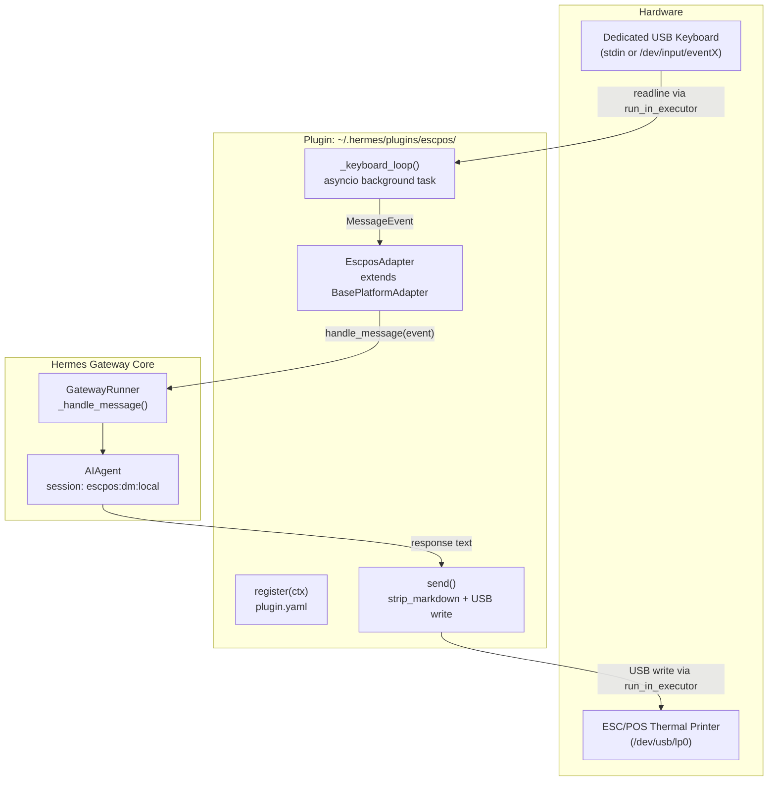

# PRD: ESC/POS Thermal Printer Platform Adapter for Hermes Gateway

---

## 1. Overview

This document specifies the requirements for a Hermes gateway platform adapter that routes agent conversations through a locally connected ESC/POS thermal printer (output) and a dedicated USB keyboard (input). The adapter is implemented as a drop-in plugin — no core Hermes code changes required.

**Delivery path:** `~/.hermes/plugins/escpos/`

---

## 2. Problem Statement

Hermes currently supports 20+ messaging platforms, all of which are network-based. There is no support for local hardware I/O. A thermal printer + keyboard setup is a valid deployment target for kiosk, retail, or embedded environments where the agent must operate without a screen or network-facing chat interface.

---

## 3. Goals

| # | Goal |
|---|------|
| G1 | Agent responses are printed to an ESC/POS thermal printer connected via USB |
| G2 | A dedicated USB keyboard is the sole input device; each Enter keypress dispatches a message to the agent |
| G3 | The adapter integrates with the existing gateway lifecycle with zero core code changes |
| G4 | The LLM is guided to produce short, plain-text responses appropriate for thermal paper |
| G5 | Blocking USB I/O never stalls the asyncio event loop |

## 4. Non-Goals

| # | Non-Goal |
|---|----------|
| NG1 | Streaming/partial output to the printer (ESC/POS has no edit-in-place) |
| NG2 | Multi-user or multi-session support (single `chat_id="local"`) |
| NG3 | Network-based ESC/POS (e.g., Ethernet printers) — USB only in v1 |
| NG4 | Rich media (images, QR codes) — text-only in v1 |
| NG5 | Modifying any file in `gateway/`, `agent/`, `hermes_cli/`, or `tools/` |

---

## 5. User Stories

**US-1 — Basic conversation:**
> As a kiosk operator, I type a question on the dedicated keyboard and press Enter. The agent's response prints on the thermal receipt paper.

**US-2 — Multi-turn conversation:**
> As a user, I can ask follow-up questions. The adapter maintains session state across turns using the gateway's existing session store (key: `agent:main:escpos:dm:local`).

**US-3 — Slash commands:**
> As an operator, I can type `/stop`, `/new`, `/status` on the keyboard. These are dispatched as slash commands through the existing `GatewayRunner` command handler, not as agent messages.

**US-4 — Gateway startup:**
> As a developer, I add `ESCPOS_ENABLED=1` to `~/.hermes/.env`. The gateway auto-detects the plugin and starts the adapter on `hermes gateway run`.

**US-5 — Graceful shutdown:**
> When the gateway stops, the keyboard read loop exits cleanly and the USB printer handle is closed without resource leaks.

---

## 6. Architecture



---

## 7. File Structure

```
~/.hermes/plugins/escpos/
├── plugin.yaml        # Plugin metadata, optional_env declarations
└── adapter.py         # EscposAdapter class + register() entry point
```

No other files are created or modified. [1](#5-0)

---

## 8. Functional Requirements

### 8.1 `plugin.yaml`

| Field | Value |
|-------|-------|
| `name` | `escpos` |
| `kind` | `platform` |
| `label` | `ESC/POS Printer` |
| `optional_env` | `ESCPOS_DEVICE`, `ESCPOS_ENABLED`, `ESCPOS_ALLOW_ALL` |

No `requires_env` — the adapter has no mandatory API token. The `optional_env` block surfaces these vars in `hermes config` UI automatically. [2](#5-1)

### 8.2 `register(ctx)`

Must call `ctx.register_platform()` with:

| Parameter | Value / Rationale |
|-----------|-------------------|
| `name` | `"escpos"` |
| `label` | `"ESC/POS Printer"` |
| `adapter_factory` | `lambda cfg: EscposAdapter(cfg)` |
| `check_fn` | Returns `True` if `ESCPOS_DEVICE` path exists or `/dev/usb/lp0` is present |
| `env_enablement_fn` | Returns `{"enabled": True}` when `ESCPOS_ENABLED=1` is set; `None` otherwise |
| `allow_all_env` | `"ESCPOS_ALLOW_ALL"` — local hardware, operator sets this to bypass auth |
| `platform_hint` | `"You are on a thermal receipt printer. Keep responses under 200 words. Use plain text only — no markdown, no bullet points, no code blocks."` |
| `max_message_length` | `500` — thermal paper is narrow; triggers smart chunking |
| `emoji` | `"🖨️"` | [3](#5-2)

### 8.3 `EscposAdapter.__init__()`

- Calls `super().__init__(config, Platform("escpos"))` [4](#5-3)
- Reads `ESCPOS_DEVICE` env var (default: `/dev/usb/lp0`) from `config.extra` or `os.environ`
- Initializes `self._input_task: asyncio.Task | None = None`
- Initializes `self._printer_path: str`

### 8.4 `connect()` — Required

1. Verify `self._printer_path` device exists; if not, call `self._set_fatal_error("device_missing", ..., retryable=False)` and return `False`
2. Perform a test write (ESC/POS initialize sequence `\x1b\x40`) via `run_in_executor` to confirm the printer is responsive
3. Start `self._input_task = asyncio.create_task(self._keyboard_loop())`
4. Call `self._mark_connected()`
5. Return `True`

Reference: IRC adapter `connect()` pattern. [5](#5-4)

### 8.5 `_keyboard_loop()` — Core Inbound Path

```
while self._running:
    line = await loop.run_in_executor(None, sys.stdin.readline)
    if not line: break
    text = line.strip()
    if not text: continue
    await self._dispatch(text)
```

- Uses `run_in_executor(None, ...)` — `stdin.readline()` is blocking I/O and must not block the event loop
- Checks `self._running` on each iteration — set to `False` by `_mark_disconnected()` on shutdown
- Handles `asyncio.CancelledError` by re-raising (same pattern as IRC `_receive_loop`) [6](#5-5)

### 8.6 `_dispatch(text)` — MessageEvent Construction

Builds a `MessageEvent` and calls `self.handle_message(event)`:

| Field | Value |
|-------|-------|
| `text` | The stripped keyboard input |
| `message_type` | `MessageType.TEXT` |
| `source.chat_id` | `"local"` |
| `source.chat_name` | `"ESC/POS Terminal"` |
| `source.chat_type` | `"dm"` |
| `source.user_id` | `"local_user"` |
| `source.user_name` | `"Operator"` |
| `message_id` | `str(uuid.uuid4())` |

This produces session key `agent:main:escpos:dm:local` in `GatewayRunner`. [7](#5-6) [8](#5-7)

### 8.7 `send()` — Required Outbound Path

1. Call `strip_markdown(content)` from `gateway.platforms.helpers` [9](#5-8)
2. Append ESC/POS paper feed bytes: `\n\n\x1b\x64\x03` (feed 3 lines after each response)
3. Write to `self._printer_path` via `loop.run_in_executor(None, self._write_to_printer, data)` — USB writes are blocking
4. Return `SendResult(success=True, message_id=str(uuid.uuid4()))`
5. On `OSError`: return `SendResult(success=False, error=str(e))`

### 8.8 `disconnect()` — Required

1. Call `self._mark_disconnected()` — sets `self._running = False`
2. Cancel `self._input_task` and `await` it, swallowing `CancelledError`
3. Set `self._input_task = None`

Reference: IRC adapter `disconnect()`. [10](#5-9)

### 8.9 `get_chat_info()` — Optional Override

Returns `{"name": "ESC/POS Terminal", "type": "dm"}` for `chat_id="local"`.

---

## 9. Configuration

### Environment Variables

| Variable | Required | Default | Description |
|----------|----------|---------|-------------|
| `ESCPOS_ENABLED` | Yes (to activate) | — | Set to `1` to enable the adapter |
| `ESCPOS_DEVICE` | No | `/dev/usb/lp0` | Path to the USB printer device |
| `ESCPOS_ALLOW_ALL` | No | — | Set to `1` to bypass authorization (recommended for local use) |

### `~/.hermes/.env` example

```
ESCPOS_ENABLED=1
ESCPOS_DEVICE=/dev/usb/lp0
ESCPOS_ALLOW_ALL=1
```

### `config.yaml` example (alternative)

```yaml
gateway:
  platforms:
    escpos:
      enabled: true
      extra:
        device: /dev/usb/lp0
```

---

## 10. Non-Functional Requirements

| # | Requirement |
|---|-------------|
| NFR-1 | All USB I/O (printer writes, device open) must use `loop.run_in_executor(None, ...)` — never block the asyncio event loop |
| NFR-2 | `stdin.readline()` must use `run_in_executor` for the same reason |
| NFR-3 | `disconnect()` must complete without hanging — `_input_task.cancel()` must be awaited |
| NFR-4 | If the printer device is missing at `connect()` time, the adapter must fail with `retryable=False` (not retry-loop forever) |
| NFR-5 | The adapter must not import any library not in the Python standard library (no `python-escpos` SDK dependency in v1 — raw device file write is sufficient) |
| NFR-6 | `check_fn` must not raise exceptions — wrap device existence check in `try/except` |

---

## 11. LLM Behavior Guidance

The `platform_hint` registered in `register(ctx)` is injected into the system prompt by `GatewayRunner` for every conversation on this platform. [11](#5-10)

Recommended hint:
```
You are responding via a thermal receipt printer. Rules:
- Keep responses under 200 words.
- Use plain text only. No markdown, no bullet points, no code blocks, no headers.
- Prefer short sentences. Avoid lists.
- If asked to write code, describe it in plain English instead.
```

The `max_message_length=500` parameter triggers the gateway's smart chunking, which splits long responses at sentence boundaries before calling `send()`. This prevents a single 2000-word response from printing as one unbroken block.

---

## 12. Authorization

Since this is a local hardware device with no network exposure, the recommended configuration is `ESCPOS_ALLOW_ALL=1`. This maps to the `allow_all_env="ESCPOS_ALLOW_ALL"` parameter in `register()`, which the gateway's multi-layer authorization check evaluates. [12](#5-11)

Without `ESCPOS_ALLOW_ALL=1`, the gateway will reject all messages from `user_id="local_user"` as unauthorized.

---

## 13. What the Plugin System Handles Automatically

The following integration points require **no additional code** once `ctx.register_platform()` is called: [13](#5-12)

- `hermes gateway status` — shows `ESC/POS Printer (plugin)` with connection state
- `hermes gateway setup` — adapter appears in the interactive setup menu
- `hermes config` — `ESCPOS_DEVICE`, `ESCPOS_ENABLED` appear as configurable entries
- Session management — per-chat interrupt events, message queuing, `/stop` handling
- Slash command dispatch — `/stop`, `/new`, `/status`, `/approve`, `/deny` all work
- System prompt injection — `platform_hint` is automatically prepended

---

## 14. Testing Requirements

| Test | Description |
|------|-------------|
| T-1 | `EscposAdapter.__init__` reads `ESCPOS_DEVICE` from env and `config.extra` |
| T-2 | `connect()` returns `False` and sets fatal error when device path does not exist |
| T-3 | `connect()` starts `_keyboard_loop` task and calls `_mark_connected()` |
| T-4 | `_dispatch()` builds correct `MessageEvent` with `chat_id="local"`, `chat_type="dm"` |
| T-5 | `send()` calls `strip_markdown()` before writing |
| T-6 | `send()` returns `SendResult(success=False)` on `OSError` without raising |
| T-7 | `disconnect()` cancels `_input_task` and sets `_running=False` |
| T-8 | `_keyboard_loop` exits cleanly on `CancelledError` |
| T-9 | `check_fn` returns `False` without raising when device is absent |
| T-10 | `env_enablement_fn` returns `None` when `ESCPOS_ENABLED` is unset |

---

## 15. Open Questions / Risks

| # | Item | Severity |
|---|------|----------|
| OQ-1 | **stdin vs. `/dev/input/eventX`**: Reading from `stdin` works when the gateway is run in a terminal. If run as a systemd service (no TTY), `stdin` is `/dev/null`. The adapter may need to read from a raw input device path (`ESCPOS_INPUT_DEVICE=/dev/input/event0`) using the `evdev` library or raw file reads. | High |
| OQ-2 | **Printer paper width**: ESC/POS printers vary (58mm ≈ 32 chars/line, 80mm ≈ 48 chars/line). `max_message_length` may need to be configurable via `ESCPOS_LINE_WIDTH`. | Medium |
| OQ-3 | **USB permissions**: On Linux, `/dev/usb/lp0` requires the `lp` group or a udev rule. The `check_fn` should check both existence and write permission. | Medium |
| OQ-4 | **Systemd service mode**: When run as a system service, the gateway has no controlling terminal. The keyboard input strategy (stdin vs. evdev) must be decided before deployment. | High |
| OQ-5 | **Character encoding**: ESC/POS printers vary in supported encodings (CP437, CP850, UTF-8 with firmware support). The `_write_to_printer` function should encode with `errors="replace"` and make the encoding configurable via `ESCPOS_ENCODING`. | Low |

---

## 16. Deliverables

| File | Description |
|------|-------------|
| `~/.hermes/plugins/escpos/plugin.yaml` | Plugin metadata and env var declarations |
| `~/.hermes/plugins/escpos/adapter.py` | `EscposAdapter` class + `register()` entry point |
| `tests/gateway/test_escpos.py` | Unit tests covering T-1 through T-10 |

### Citations

**File:** website/docs/developer-guide/adding-platform-adapters.md (L31-39)
```markdown
## Plugin Path (Recommended)

The plugin system lets you add a platform adapter without modifying any core Hermes code. Your plugin is a directory with two files:

```
~/.hermes/plugins/my-platform/
  plugin.yaml      # Plugin metadata
  adapter.py       # Adapter class + register() entry point
```
```

**File:** website/docs/developer-guide/adding-platform-adapters.md (L41-62)
```markdown
### plugin.yaml

Plugin metadata. The `requires_env` and `optional_env` blocks auto-populate `hermes config` UI entries (see [Surfacing Env Vars](#surfacing-env-vars-in-hermes-config) below).

```yaml
name: my-platform
label: My Platform
kind: platform
version: 1.0.0
description: My custom messaging platform adapter
author: Your Name
requires_env:
  - MY_PLATFORM_TOKEN          # bare string works
  - name: MY_PLATFORM_CHANNEL  # or rich dict for better UX
    description: "Channel to join"
    prompt: "Channel"
    password: false
optional_env:
  - name: MY_PLATFORM_HOME_CHANNEL
    description: "Default channel for cron delivery"
    password: false
```
```

**File:** website/docs/developer-guide/adding-platform-adapters.md (L117-148)
```markdown
def register(ctx):
    """Plugin entry point — called by the Hermes plugin system."""
    ctx.register_platform(
        name="my_platform",
        label="My Platform",
        adapter_factory=lambda cfg: MyPlatformAdapter(cfg),
        check_fn=check_requirements,
        validate_config=validate_config,
        required_env=["MY_PLATFORM_TOKEN"],
        install_hint="pip install my-platform-sdk",
        # Env-driven auto-configuration — seeds PlatformConfig.extra from
        # env vars before adapter construction. See "Env-Driven Auto-
        # Configuration" section below.
        env_enablement_fn=_env_enablement,
        # Cron home-channel delivery support. Lets deliver=my_platform cron
        # jobs route without editing cron/scheduler.py. See "Cron Delivery"
        # section below.
        cron_deliver_env_var="MY_PLATFORM_HOME_CHANNEL",
        # Per-platform user authorization env vars
        allowed_users_env="MY_PLATFORM_ALLOWED_USERS",
        allow_all_env="MY_PLATFORM_ALLOW_ALL_USERS",
        # Message length limit for smart chunking (0 = no limit)
        max_message_length=4000,
        # LLM guidance injected into system prompt
        platform_hint=(
            "You are chatting via My Platform. "
            "It supports markdown formatting."
        ),
        # Display
        emoji="💬",
    )

```

**File:** website/docs/developer-guide/adding-platform-adapters.md (L174-199)
```markdown
### What the Plugin System Handles Automatically

When you call `ctx.register_platform()`, the following integration points are handled for you — no core code changes needed:

| Integration point | How it works |
|---|---|
| Gateway adapter creation | Registry checked before built-in if/elif chain |
| Config parsing | `Platform._missing_()` accepts any platform name |
| Connected platform validation | Registry `validate_config()` called |
| User authorization | `allowed_users_env` / `allow_all_env` checked |
| Env-only auto-enable | `env_enablement_fn` seeds `PlatformConfig.extra` + `home_channel` |
| YAML config bridge | `apply_yaml_config_fn` translates `config.yaml` keys into env vars / extras |
| Cron delivery | `cron_deliver_env_var` makes `deliver=<name>` work |
| `hermes config` UI entries | `requires_env` / `optional_env` in `plugin.yaml` auto-populate |
| send_message tool | Routes through live gateway adapter |
| Webhook cross-platform delivery | Registry checked for known platforms |
| `/update` command access | `allow_update_command` flag |
| Channel directory | Plugin platforms included in enumeration |
| System prompt hints | `platform_hint` injected into LLM context |
| Message chunking | `max_message_length` for smart splitting |
| PII redaction | `pii_safe` flag |
| `hermes status` | Shows plugin platforms with `(plugin)` tag |
| `hermes gateway setup` | Plugin platforms appear in setup menu |
| `hermes tools` / `hermes skills` | Plugin platforms in per-platform config |
| Token lock (multi-profile) | Use `acquire_scoped_lock()` in your `connect()` |
| Orphaned config warning | Descriptive log when plugin is missing |
```

**File:** website/docs/developer-guide/adding-platform-adapters.md (L515-532)
```markdown
For inbound messages, build a `MessageEvent` and call `self.handle_message(event)`:

```python
source = self.build_source(
    chat_id=chat_id,
    chat_name=name,
    chat_type="dm",  # or "group"
    user_id=user_id,
    user_name=user_name,
)
event = MessageEvent(
    text=content,
    message_type=MessageType.TEXT,
    source=source,
    message_id=msg_id,
)
await self.handle_message(event)
```
```

**File:** website/docs/developer-guide/adding-platform-adapters.md (L577-591)
```markdown
### 9. Optional: Platform Hints

**`agent/prompt_builder.py`** — If your platform has specific rendering limitations (no markdown, message length limits, etc.), add an entry to the `_PLATFORM_HINTS` dict. This injects platform-specific guidance into the system prompt:

```python
_PLATFORM_HINTS = {
    # ...
    "newplat": (
        "You are chatting via NewPlat. It supports markdown formatting "
        "but has a 4000-character message limit."
    ),
}
```

Not all platforms need hints — only add one if the agent's behavior should differ.
```

**File:** gateway/platforms/base.py (L1826-1834)
```python
    def __init__(self, config: PlatformConfig, platform: Platform):
        self.config = config
        self.platform = platform
        self._message_handler: Optional[MessageHandler] = None
        # Optional hook (e.g. Telegram DM topic recovery) that rewrites
        # ``event.source.thread_id`` before session keying. Returns the
        # corrected thread_id or None to leave the source untouched.
        self._topic_recovery_fn: Optional[Callable[[Any], Optional[str]]] = None
        self._running = False
```

**File:** plugins/platforms/irc/adapter.py (L155-220)
```python
    async def connect(self) -> bool:
        """Connect to the IRC server, register, and join the channel."""
        if not self.server or not self.channel:
            logger.error("IRC: server and channel must be configured")
            self._set_fatal_error(
                "config_missing",
                "IRC_SERVER and IRC_CHANNEL must be set",
                retryable=False,
            )
            return False

        # Prevent two profiles from using the same IRC identity
        try:
            from gateway.status import acquire_scoped_lock, release_scoped_lock
            lock_key = f"{self.server}:{self.nickname}"
            if not acquire_scoped_lock("irc", lock_key):
                logger.error("IRC: %s@%s already in use by another profile", self.nickname, self.server)
                self._set_fatal_error("lock_conflict", "IRC identity in use by another profile", retryable=False)
                return False
            self._lock_key = lock_key
        except ImportError:
            self._lock_key = None  # status module not available (e.g. tests)

        try:
            ssl_ctx = None
            if self.use_tls:
                ssl_ctx = ssl.create_default_context()

            self._reader, self._writer = await asyncio.wait_for(
                asyncio.open_connection(self.server, self.port, ssl=ssl_ctx),
                timeout=30.0,
            )
        except Exception as e:
            logger.error("IRC: failed to connect to %s:%s — %s", self.server, self.port, e)
            self._set_fatal_error("connect_failed", str(e), retryable=True)
            return False

        # IRC registration sequence
        if self.server_password:
            await self._send_raw(f"PASS {self.server_password}")
        await self._send_raw(f"NICK {self.nickname}")
        await self._send_raw(f"USER {self.nickname} 0 * :Hermes Agent")

        # Start receive loop
        self._recv_task = asyncio.create_task(self._receive_loop())

        # Wait for registration (001 RPL_WELCOME) with timeout
        try:
            await asyncio.wait_for(self._registration_event.wait(), timeout=30.0)
        except asyncio.TimeoutError:
            logger.error("IRC: registration timed out")
            await self.disconnect()
            self._set_fatal_error("registration_timeout", "IRC server did not send RPL_WELCOME", retryable=True)
            return False

        # NickServ identification
        if self.nickserv_password:
            await self._send_raw(f"PRIVMSG NickServ :IDENTIFY {self.nickserv_password}")
            await asyncio.sleep(2)  # Give NickServ time to process

        # Join channel
        await self._send_raw(f"JOIN {self.channel}")

        self._mark_connected()
        logger.info("IRC: connected to %s:%s as %s, joined %s", self.server, self.port, self._current_nick, self.channel)
        return True
```

**File:** plugins/platforms/irc/adapter.py (L222-254)
```python
    async def disconnect(self) -> None:
        """Quit and close the connection."""
        # Release the scoped lock so another profile can use this identity
        if getattr(self, "_lock_key", None):
            try:
                from gateway.status import release_scoped_lock
                release_scoped_lock("irc", self._lock_key)
            except Exception:
                pass
        self._mark_disconnected()
        if self._writer and not self._writer.is_closing():
            try:
                await self._send_raw("QUIT :Hermes Agent shutting down")
                await asyncio.sleep(0.5)
            except Exception:
                pass
            try:
                self._writer.close()
                await self._writer.wait_closed()
            except Exception:
                pass

        if self._recv_task and not self._recv_task.done():
            self._recv_task.cancel()
            try:
                await self._recv_task
            except asyncio.CancelledError:
                pass

        self._reader = None
        self._writer = None
        self._registered = False
        self._registration_event.clear()
```

**File:** plugins/platforms/irc/adapter.py (L367-391)
```python
    async def _receive_loop(self) -> None:
        """Main receive loop — reads lines and dispatches them."""
        buffer = b""
        try:
            while self._reader and not self._reader.at_eof():
                data = await self._reader.read(4096)
                if not data:
                    break
                buffer += data
                while b"\r\n" in buffer:
                    line, buffer = buffer.split(b"\r\n", 1)
                    try:
                        decoded = line.decode("utf-8", errors="replace")
                        await self._handle_line(decoded)
                    except Exception as e:
                        logger.warning("IRC: error handling line: %s", e)
        except asyncio.CancelledError:
            raise
        except Exception as e:
            logger.error("IRC: receive loop error: %s", e)
        finally:
            if self.is_connected:
                logger.warning("IRC: connection lost, marking disconnected")
                self._set_fatal_error("connection_lost", "IRC connection closed unexpectedly", retryable=True)
                await self._notify_fatal_error()
```

**File:** website/docs/developer-guide/gateway-internals.md (L60-66)
```markdown
3. **GatewayRunner._handle_message()** receives the event:
   - Resolve session key via `_session_key_for_source()` (format: `agent:main:{platform}:{chat_type}:{chat_id}`)
   - Check authorization (see Authorization below)
   - Check if it's a slash command → dispatch to command handler
   - Check if agent is already running → intercept commands like `/stop`, `/status`
   - Otherwise → create `AIAgent` instance and run conversation
4. **Response** is sent back through the platform adapter
```

**File:** website/docs/developer-guide/gateway-internals.md (L90-99)
```markdown
## Authorization

The gateway uses a multi-layer authorization check, evaluated in order:

1. **Per-platform allow-all flag** (e.g., `TELEGRAM_ALLOW_ALL_USERS`) — if set, all users on that platform are authorized
2. **Platform allowlist** (e.g., `TELEGRAM_ALLOWED_USERS`) — comma-separated user IDs
3. **DM pairing** — authenticated users can pair new users via a pairing code
4. **Global allow-all** (`GATEWAY_ALLOW_ALL_USERS`) — if set, all users across all platforms are authorized
5. **Default: deny** — unauthorized users are rejected

```

**File:** gateway/platforms/helpers.py (L180-195)
```python
def strip_markdown(text: str) -> str:
    """Strip markdown formatting for plain-text platforms (SMS, iMessage, etc.).

    Replaces the identical ``_strip_markdown()`` functions previously
    duplicated in sms.py, bluebubbles.py, and feishu.py.
    """
    text = _RE_BOLD.sub(r"\1", text)
    text = _RE_ITALIC_STAR.sub(r"\1", text)
    text = _RE_BOLD_UNDER.sub(r"\1", text)
    text = _RE_ITALIC_UNDER.sub(r"\1", text)
    text = _RE_CODE_BLOCK.sub("", text)
    text = _RE_INLINE_CODE.sub(r"\1", text)
    text = _RE_HEADING.sub("", text)
    text = _RE_LINK.sub(r"\1", text)
    text = _RE_MULTI_NEWLINE.sub("\n\n", text)
    return text.strip()
```
